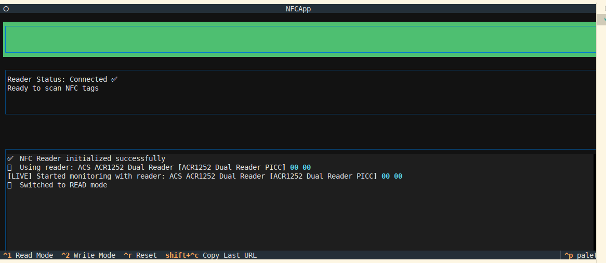
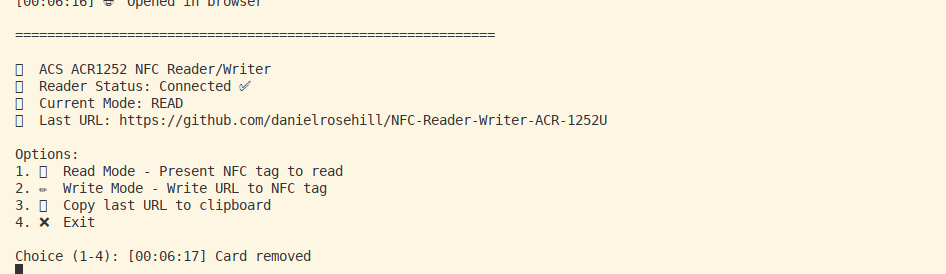
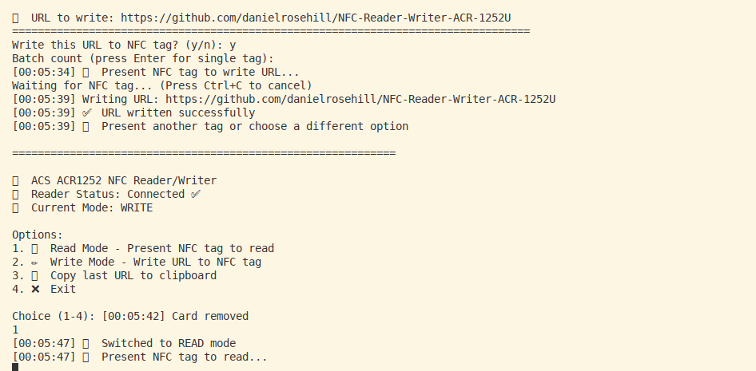

# ACS ACR1252 USB NFC Reader - TUI & CLI (Ubuntu Linux)



A command-line interface for reading and writing NFC tags using the ACS ACR1252 USB NFC Reader on Linux systems.

## Features

- **Read Mode**: Continuously scan NFC tags and automatically open URLs in browser
- **Write Mode**: Write URLs to NFC tags with optional permanent locking
- **Batch Writing**: Write the same URL to multiple tags sequentially
- **Modern TUI**: Beautiful terminal user interface with keyboard shortcuts
- **Cross-platform**: Works on Linux systems with proper NFC reader support

## Hardware Requirements

- ACS ACR1252 USB NFC Reader/Writer
- NTAG213/215/216 NFC tags (recommended)
- Linux system with USB support

## Installation

1. Clone this repository:
```bash
git clone https://github.com/yourusername/ACS-ACR-1252-NFC-CLI-Linux.git
cd ACS-ACR-1252-NFC-CLI-Linux
```

2. Install dependencies:
```bash
pip install -r requirements.txt
```

3. Run the application:
```bash
python main.py
```

## Usage

### CLI

Reading tags:



Writing & locking operation:



### TUI Mode (Default)

Run the application to launch the terminal user interface:

```bash
python main.py
```

**Keyboard Shortcuts:**
- `Ctrl+1`: Switch to Read Mode
- `Ctrl+2`: Switch to Write Mode
- `Ctrl+Q`: Quit application

**Read Mode:**
- Present NFC tag to reader
- URL will be automatically opened in browser
- URL copied to clipboard

**Write Mode:**
1. Enter URL in the input field
2. Optionally set batch count for multiple tags
3. Check "Lock tags" to permanently lock tags after writing (irreversible!)
4. Press Enter or click "Start Writing"
5. Present NFC tag(s) to reader
- MIFARE Ultralight
- MIFARE Classic (with NDEF formatting)
- ISO14443 Type A tags

## Example URLs

The CLI can handle long URLs like:
```
https://homebox.residencejlm.com/item/6183cbf5-6441-4409-9fb1-eef1eb6f4805
```

## Troubleshooting

### Reader Not Found
- Ensure the ACS ACR1252 is connected via USB
- Check that pcscd daemon is running: `sudo systemctl status pcscd`
- Verify reader is detected: `pcsc_scan`

### Permission Issues
- Add your user to the `scard` group: `sudo usermod -a -G scard $USER`
- Log out and back in for group changes to take effect

### Tag Read/Write Failures
- Ensure tag is NDEF-compatible
- Try different tag positioning on the reader
- Check that the tag isn't locked or damaged

## Development

### Project Structure
```
├── main.py           # CLI entry point
├── nfc_handler.py    # NFC operations and card monitoring
├── nfc_tui.py        # Textual TUI interface
├── requirements.txt  # Python dependencies
└── README.md         # This file
```

### Dependencies
- `pyscard`: PC/SC smartcard library interface
- `ndeflib`: NDEF message encoding/decoding
- `textual`: Modern TUI framework
- `click`: Command-line interface creation

## License

MIT License - see LICENSE file for details.

## Contributing

1. Fork the repository
2. Create a feature branch
3. Make your changes
4. Add tests if applicable
5. Submit a pull request

## Support

For issues and questions:
- Open an issue on GitHub
- Check the troubleshooting section above
- Ensure your hardware is compatible
